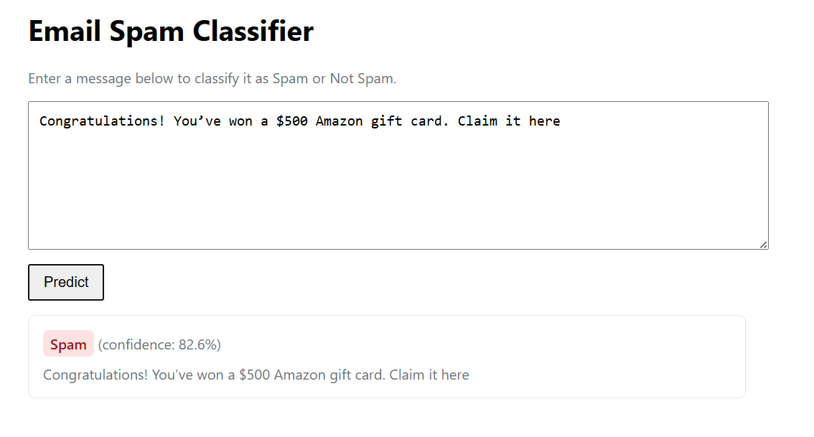

# Email Spam Classifier Web App

A minimal Flask web app that loads a trained `MultinomialNB` spam classifier and `TfidfVectorizer` from saved artifacts, providing a simple UI and a JSON API to classify messages as Spam or Not Spam.



## Features
- Web UI at `/` to input a message and view prediction.
- Health check at `/health` for quick diagnostics.
- JSON API at `/predict` for programmatic access.

## Quick Start

```powershell
# From project root
. .\.venv\Scripts\Activate.ps1
pip install -r requirements.txt
python app.py
```

Open http://localhost:5000/ in your browser.

## API Usage
- Endpoint: `POST /predict`
- Body (JSON): `{ "text": "your message" }`
- Response: `{ "predicted_label": "Spam|Not Spam", "confidence": 0.93, ... }`

## Artifacts
- Model: `spam_model.pkl`
- Vectorizer: `tfidf_vectorizer.pkl`
- Dataset: `spam.csv`

## Project Structure
- `app.py` — Flask app
- `templates/index.html` — UI template
- `spam.ipynb` — training notebook
- `screenshot/image.png` — app screenshot
